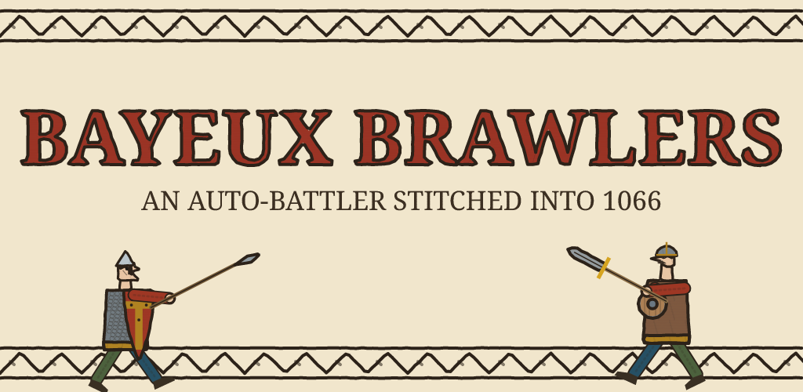
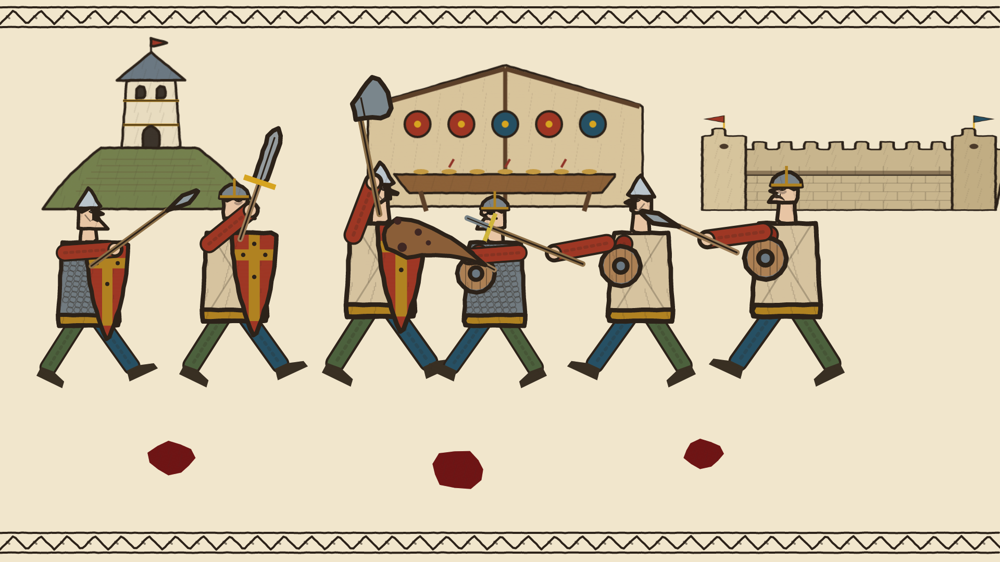
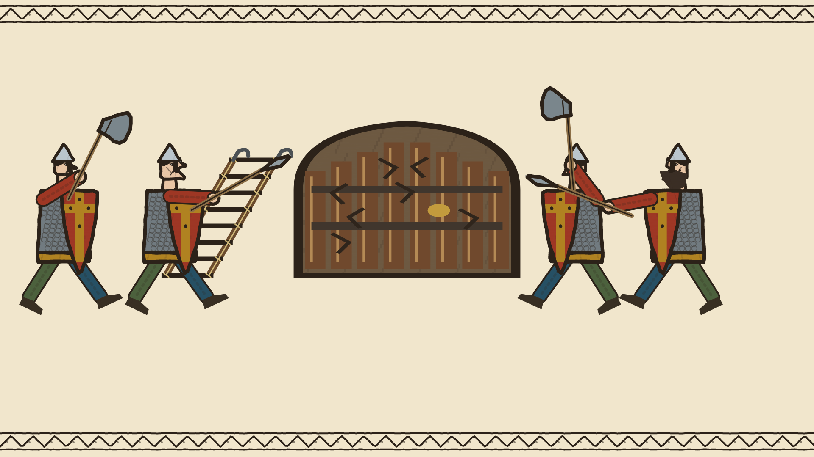
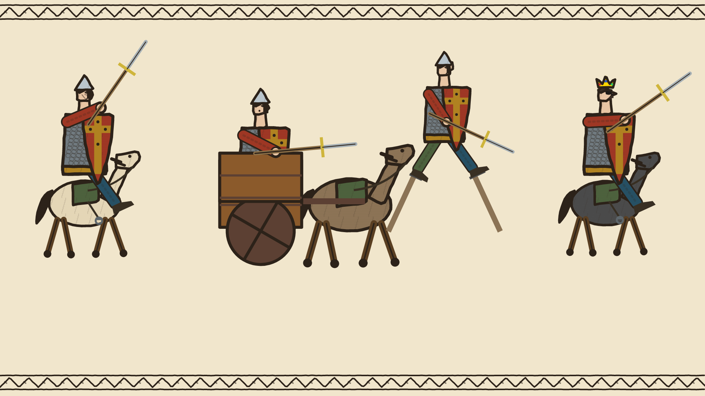
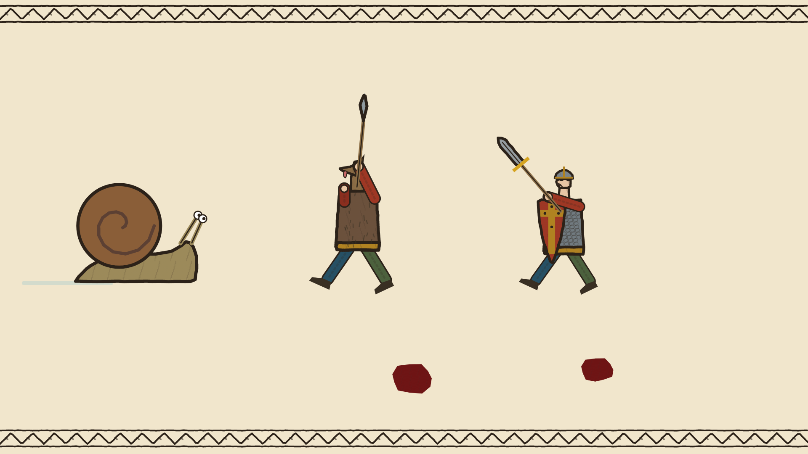

<div align="center">



**A medieval auto-battler for Android, drawn and scored entirely in code.**

Kotlin · Jetpack Compose · no game engine · no art or audio assets

</div>

---

Build a Norman knight from an absurd catalogue of weapon heads, handles, armour and companions, then watch him fight escalating waves of Saxons across a living Bayeux Tapestry. Win, pick a roguelike upgrade, and push your luck: the less armour you wear, the bigger your score multiplier.

Everything on screen is vector paths drawn at runtime in a hand-stitched style, and every note of music is synthesised on the device from a per-run seed.

<table>
  <tr>
    <td></td>
    <td></td>
  </tr>
  <tr>
    <td></td>
    <td></td>
  </tr>
</table>

## Status

Closed testing on Google Play is complete, and the public release is coming soon. The game is fully offline: no accounts and no server.

## How it's built

| | |
|---|---|
| **Rendering** | A custom 2D renderer on Compose `Canvas`. Characters, weapons, mounts, buildings and weather are all vector paths with an embroidery-stitch treatment. No sprites, no bitmaps, no engine. |
| **Game loop** | A 60 fps coroutine loop (`withFrameMillis`) drives the combat simulation. `StateFlow` in a single `GameViewModel` gives one-way data flow into Compose. |
| **Combat** | Pierce, slash and blunt damage against armour and shields; status effects; mounted and ranged enemies; bosses; sieges. Gear is modular: weapon heads and handles combine, so builds really do differ. |
| **Music** | A seeded procedural composer. It picks a tune family, mode and metre, writes a melody with proper cadences, then orchestrates it across a level ladder: a solo harp at level 1, a full consort by level 12. The same seed always renders the same piece, and level-ups crossfade in phase. |
| **Sound design** | Plucked strings via Karplus-Strong, bowed and brass voices, membranes and bells, all rendered to PCM and streamed through `AudioTrack` with reverb and a limiter. |
| **Persistence** | DataStore keeps earned gear, milestones, high scores and deaths. |
| **Monetisation** | Play Billing plus AdMob behind a UMP consent flow. One ad gate owns every decision: kill switches for debug builds and ad-free purchases, and pacing that keeps ads out of a player's first session. |

The deeper design notes, including the music engine's invariants, are in [ARCHITECTURE.md](ARCHITECTURE.md).

## Testing

About 370 JVM tests run under Robolectric, covering combat maths, stats, enemy generation, milestones, the saved profile, ad gating and the audio engine.

Visual changes are checked with [Roborazzi](https://github.com/takahirom/roborazzi) screenshot tests. The rendered frames in [`app/src/test/screenshots/`](app/src/test/screenshots/) double as regression baselines, so art is reviewed as images without needing a device. The screenshots above come from that suite.

```sh
gradle :app:testDebugUnitTest                                   # run the suite
gradle :app:testDebugUnitTest "-Proborazzi.test.record=true"    # re-record screenshot baselines
```

## Build and run

Requires Android Studio (or JDK 17+) and Gradle 9.x. The project has no Gradle wrapper, so use a system Gradle.

```sh
gradle :app:assembleDebug
```

Debug builds use Google's public AdMob test IDs automatically. Release builds read their secrets from the environment, and none are stored in the repo:

| Variable / property | Used for |
|---|---|
| `KEYSTORE_PATH`, `STORE_PASSWORD`, `KEY_PASSWORD` | Release signing |
| `ADMOB_APP_ID`, `ADMOB_INTERSTITIAL_ID`, `ADMOB_REWARDED_ID` | Live ad units (Gradle properties) |

## Project layout

```
app/src/main/java/com/example/
├── MainActivity.kt              Compose UI: screens, gear picker, battle HUD
└── game/
    ├── GameViewModel.kt         Game loop, state and progression
    ├── CombatEngine.kt          Damage, blocking, status effects
    ├── EnemyFactory.kt          Level-scaled Saxon generation
    ├── SimulationModels.kt      Fighters, gear catalogue, derived stats
    ├── TapestryRenderer.kt      Characters, weapons and effects
    ├── BuildingRenderer.kt      Castles, halls and siege works
    ├── MountRenderer.kt         Horses and beasts
    ├── StitchCraft.kt           The embroidery-stitch drawing primitives
    ├── MusicTheory.kt           Seed → song spec (mode, metre, form)
    ├── MelodyGenerator.kt       Melody, counter-voice, bass and pads
    ├── Orchestrator.kt          Who plays what, level by level
    ├── Instruments*.kt, DspCore.kt, MixMaster.kt   Synthesis and mastering
    ├── MedievalHarpPlayer.kt    Streaming, looping, crossfades
    └── Ads.kt, AdGate.kt, Billing.kt               Monetisation
```

## Credits

Designed and built by [Joshua Billitt](https://www.linkedin.com/in/joshuabillitt), developed with Claude and Google AI Studio.
